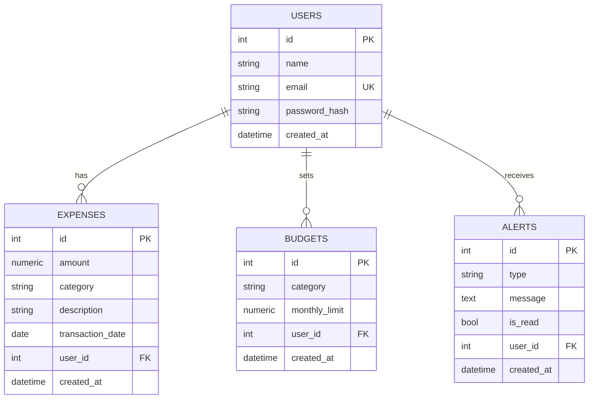

# Database Design — AI Expense Tracker

## Entity-Relationship Diagram

## Schema notes

| Table      | Key columns / constraints                                                                 |
| ---------- | ----------------------------------------------------------------------------------------- |
| `users`    | PK `id`; **unique** index on `email`.                                                     |
| `expenses` | FK `user_id → users.id` `ON DELETE CASCADE`. Composite indexes `(user_id, transaction_date)` and `(user_id, category)`; single index on `transaction_date`. |
| `budgets`  | FK `user_id → users.id` `ON DELETE CASCADE`. **Unique** `(user_id, category)` — one budget per category per user. |
| `alerts`   | FK `user_id → users.id` `ON DELETE CASCADE`. Index on `user_id`.                          |

## Categories (enum)

`Food`, `Travel`, `Shopping`, `Bills`, `Entertainment`, `Healthcare`, `Education`, `Other`

## Alert types (enum)

`budget_exceeded`, `budget_threshold` (90%), `unusual_transaction`, `spending_increase`

## Design decisions

- **Money** stored as `NUMERIC(12,2)` to avoid floating-point rounding errors.
- **Categories** stored as strings (validated by a Pydantic/Python enum) rather than a
  native DB enum, so adding categories needs no migration.
- **Cascade deletes** ensure removing a user cleans up all dependent rows.
- **Composite indexes** target the hot query paths (a user's expenses filtered by date or
  category), keeping list/analytics queries fast as data grows.
